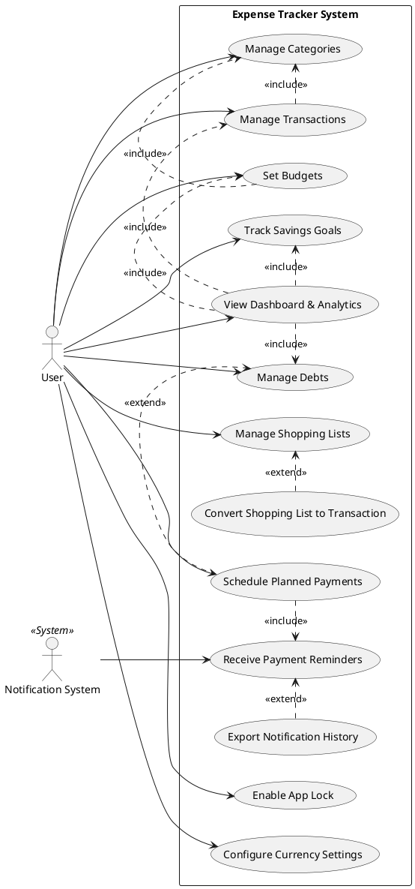
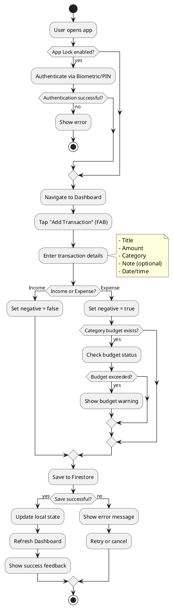
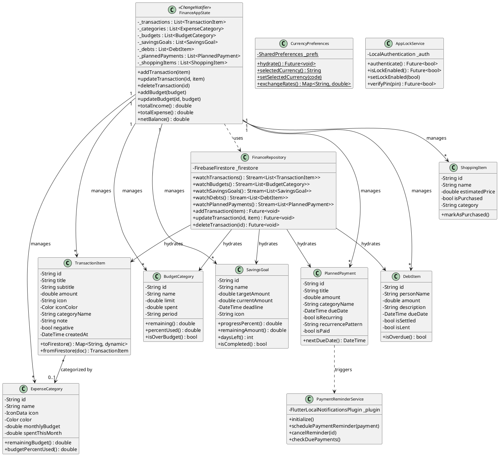
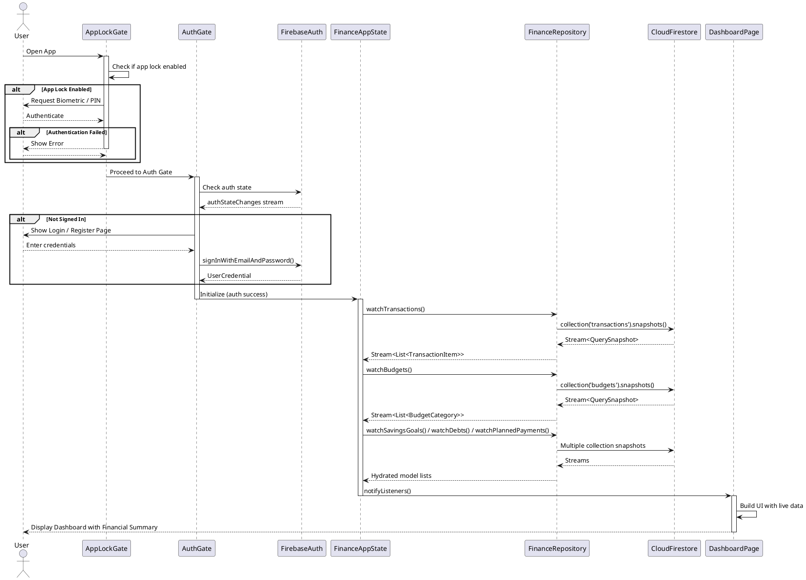
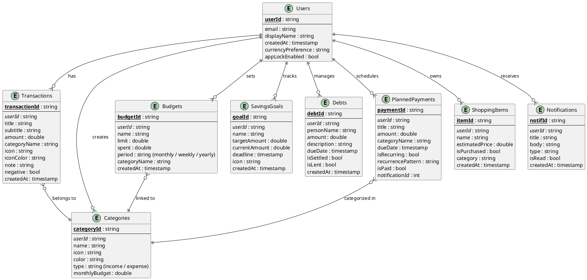
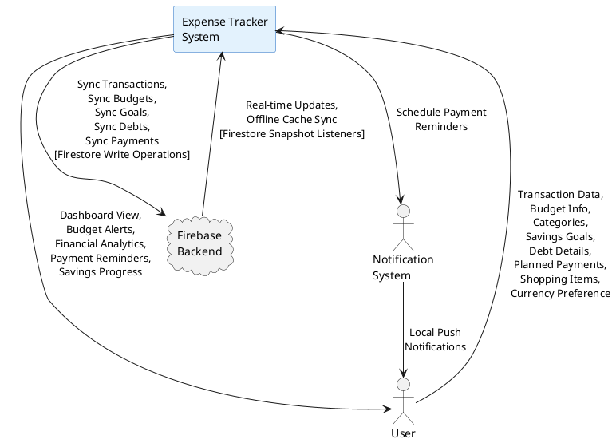
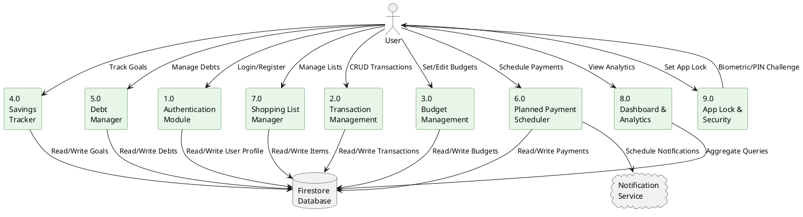
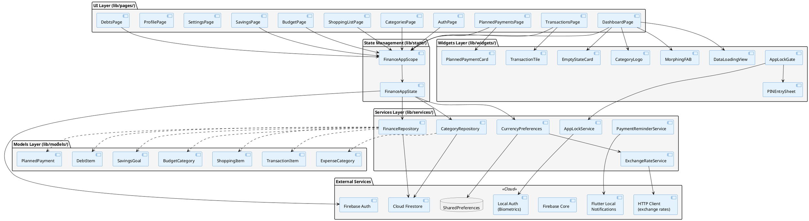
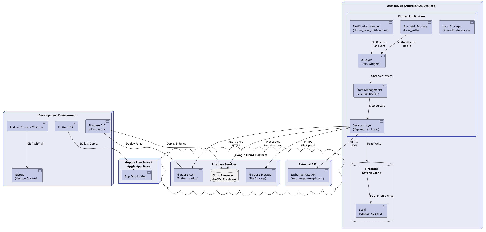

# Patuakhali Science and Technology University

## Software Development Project Report

**Course Code:** CCE-310  
**Course Title:** Software Development Project  
**Project Type:** Mobile App Development  
**Level - III, Semester – I**

---

### Submitted By

| | |
|---|---|
| **Name:** | Sakib Hasan |
| **Student ID:** | [Your ID] |
| **Registration:** | [Your Reg] |
| **Session:** | [Your Session] |
| **Faculty:** | Computer Science and Engineering |

---

### Submitted To

**Prof. Dr. Md. Samsuzzaman**  
Professor  
Department of Computer and Communication Engineering  
Faculty of Computer Science and Engineering

---

**Submission Date:** [Date]

---

## Table of Contents

1. [Project Title](#1-project-title)
2. [Introduction & Abstract](#2-introduction--abstract)
3. [Objectives](#3-objectives)
4. [Scope](#4-scope)
5. [System Analysis & Design](#5-system-analysis--design)
   - 5.1 [Use Case Diagram](#51-use-case-diagram)
   - 5.2 [Activity Diagram](#52-activity-diagram)
   - 5.3 [Class Diagram](#53-class-diagram)
   - 5.4 [Sequence Diagram](#54-sequence-diagram)
   - 5.5 [Entity-Relationship Diagram (ERD)](#55-entity-relationship-diagram-erd)
   - 5.6 [Data Flow Diagram (DFD)](#56-data-flow-diagram-dfd)
   - 5.7 [Component Diagram](#57-component-diagram)
   - 5.8 [Deployment Diagram](#58-deployment-diagram)
6. [Methodology](#6-methodology)
7. [Technology Stack](#7-technology-stack)
8. [Project Timeline](#8-project-timeline)
9. [Risk Analysis](#9-risk-analysis)
10. [Conclusion](#10-conclusion)

---

## 1. Project Title

# Expense Tracker & Personal Finance Manager

### A Cross-Platform Mobile Application for Personal Financial Management

---

## 2. Introduction & Abstract

**Expense Tracker** is a cross-platform mobile application developed using **Flutter** and **Firebase**, designed to help individuals manage their personal finances effectively. The application provides a comprehensive suite of financial tools including transaction tracking, budget management, savings goal tracking, debt management, shopping lists, planned payments, and financial analytics.

The system implements a secure, role-less (single-user) model with cloud synchronization via Firebase Firestore, offline persistence, and biometric app-lock security. Users can track income and expenses across customizable categories, set budgets with real-time progress monitoring, manage savings goals, and receive payment reminders through local notifications.

The application supports multi-currency display with real-time exchange rates, ensuring usability across different geographical regions. All financial data is stored securely in Firebase Firestore with client-side encryption for sensitive fields, and the app maintains full functionality even when offline through Firestore's offline persistence layer.

---

## 3. Objectives

### 3.1 Primary Objective

To develop a secure, intuitive, and feature-rich personal finance management mobile application using Flutter and Firebase that empowers users to take control of their financial health.

### 3.2 Functional Objectives

| # | Objective | Description |
|---|---|---|
| F1 | Transaction Management | Add, edit, delete income/expense transactions with categories, notes, and timestamps |
| F2 | Category Customization | Create and manage custom expense/income categories with icons and colors |
| F3 | Budget Tracking | Set monthly budgets per category with visual progress indicators and overspend alerts |
| F4 | Savings Goals | Create and track savings goals with target amounts, deadlines, and progress tracking |
| F5 | Debt Management | Track borrowed and lent amounts with due dates and settlement status |
| F6 | Planned Payments | Schedule recurring or one-time future payments with local notification reminders |
| F7 | Shopping Lists | Create categorized shopping lists with cost estimation and purchase tracking |
| F8 | Multi-Currency Support | View financial data in multiple currencies with real-time exchange rates |
| F9 | Biometric App Lock | Secure the application with device biometrics (fingerprint/face) and PIN fallback |
| F10 | Financial Analytics Dashboard | Visual dashboard with summary cards, charts, and financial health indicators |

### 3.3 Non-Functional Objectives

| Category | Target |
|---|---|
| **Performance** | App cold start < 3 seconds; screen transitions < 300ms |
| **Reliability** | 99.9% uptime (Firebase-dependent); full offline functionality |
| **Security** | Firebase Auth + biometric lock + encrypted local storage |
| **Usability** | Material Design 3; intuitive navigation; accessibility support |
| **Scalability** | Firestore serverless auto-scaling; supports unlimited transactions per user |
| **Portability** | Cross-platform: Android, iOS, Web, Windows, macOS, Linux |

---

## 4. Scope

### 4.1 In-Scope

- Personal transaction management (income & expenses)
- Budget creation and real-time monitoring
- Savings goal setting and tracking
- Debt/loan tracking (borrowed & lent)
- Planned payment scheduling with reminders
- Shopping list management
- Multi-currency support with exchange rates
- Biometric app-lock security
- Financial dashboard with summary analytics
- Firebase cloud synchronization
- Offline-first architecture with local persistence

### 4.2 Out-of-Scope

- Multi-user / family account sharing
- Bank account integration / Open Banking APIs
- Investment portfolio tracking
- Tax calculation and reporting
- Invoice generation
- Cryptocurrency tracking

### 4.3 Target Platforms

| Platform | Status |
|---|---|
| Android | Primary (fully tested) |
| iOS | Supported |
| Web | Supported |
| Windows | Supported |
| macOS | Supported |
| Linux | Supported |

---

## 5. System Analysis & Design

### 5.1 Use Case Diagram

The use case diagram below illustrates the interactions between the **User** and the Expense Tracker system, capturing all major functional requirements.

  

<b>📋 PlantUML Code: Use Case Diagram</b>

---

### 5.2 Activity Diagram

The activity diagram below illustrates the **full transaction creation workflow**, from authentication through data persistence.

  

<b>📋 PlantUML Code: Activity Diagram — Transaction Creation</b>

---

### 5.3 Class Diagram

The class diagram presents the core domain models and their relationships within the Flutter application.

  

<b>📋 PlantUML Code: Class Diagram</b>

---

### 5.4 Sequence Diagram

The sequence diagram illustrates the **authentication and data loading flow** when a user opens the application.

  

<b>📋 PlantUML Code: Sequence Diagram — App Startup & Auth Flow</b>

---

### 5.5 Entity-Relationship Diagram (ERD)

The ER Diagram models the Firestore document collections and their logical relationships.

  

<b>📋 PlantUML Code: Entity-Relationship Diagram</b>

---

### 5.6 Data Flow Diagram (DFD)

#### 5.6.1 Context Diagram (Level 0)

The context diagram shows the system as a single process interacting with external entities.

  

<b>📋 PlantUML Code: DFD Context Diagram (Level 0)</b>

#### 5.6.2 Level 1 DFD

<b>📋 PlantUML Code: DFD Level 1</b>

---

### 5.7 Component Diagram

The component diagram depicts the high-level software architecture of the Flutter application.

<b>📋 PlantUML Code: Component Diagram</b>

---

### 5.8 Deployment Diagram

The deployment diagram shows the physical deployment architecture of the system.

<b>📋 PlantUML Code: Deployment Diagram</b>

---

## 6. Methodology

### 6.1 Development Model

**Agile (Scrum)** — Selected for its iterative approach, allowing rapid prototyping, continuous feedback integration, and flexible adaptation to changing requirements.

- **Sprint Duration:** 2 weeks
- **Sprint Ceremonies:** Daily stand-ups, Sprint Planning, Sprint Review, Sprint Retrospective

### 6.2 Development Tools

| Category | Tool | Purpose |
|---|---|---|
| **IDE** | Android Studio / VS Code | Code development and debugging |
| **Version Control** | Git + GitHub | Source code management and collaboration |
| **Backend** | Firebase (Auth, Firestore, Storage) | Cloud infrastructure |
| **UI/UX Design** | Material Design 3 (built-in Flutter) | Design system and components |
| **Project Management** | GitHub Projects / Issues | Task tracking and sprint management |
| **Testing** | Flutter Test Framework | Unit, widget, and integration testing |
| **CI/CD** | GitHub Actions / Firebase App Distribution | Automated builds and distribution |

### 6.3 Development Phases

| Phase | Duration | Activities |
|---|---|---|
| **Phase 1:** Requirement Analysis | Week 1-2 | Gather requirements, define scope, create SRS document |
| **Phase 2:** System Design | Week 3-4 | Architecture design, database schema, UI wireframes, UML modeling |
| **Phase 3:** Core Development — Auth & Setup | Week 5-6 | Firebase integration, authentication, app lock, navigation shell |
| **Phase 4:** Core Development — Transactions | Week 7-8 | CRUD transactions, categories, dashboard summary |
| **Phase 5:** Core Development — Financial Tools | Week 9-10 | Budgets, savings goals, debts, planned payments, shopping lists |
| **Phase 6:** Advanced Features | Week 11-12 | Multi-currency, exchange rates, notification system, analytics |
| **Phase 7:** Testing & Optimization | Week 13-14 | Unit tests, widget tests, integration tests, performance optimization |
| **Phase 8:** Documentation & Deployment | Week 15-16 | Final report, user manual, app store deployment |

---

## 7. Technology Stack

| Layer | Technology | Version | Justification |
|---|---|---|---|
| **Framework** | Flutter | 3.x (stable) | Cross-platform from single codebase; rich widget ecosystem; hot reload |
| **Language** | Dart | ^3.11.3 | Strongly typed, null-safe, optimized for UI development |
| **Authentication** | Firebase Auth | ^6.5.6 | Secure email/password auth; supports OAuth providers; free tier |
| **Database** | Cloud Firestore | ^6.7.1 | NoSQL, real-time sync, offline persistence, serverless scaling |
| **Core** | Firebase Core | ^4.12.1 | Firebase initialization and configuration |
| **Local Notifications** | flutter_local_notifications | ^22.2.0 | Cross-platform scheduled local notifications |
| **Time Zone** | flutter_timezone + timezone | ^5.1.0, ^0.11.1 | Accurate timezone-aware scheduling |
| **Local Storage** | shared_preferences | ^2.5.4 | Key-value storage for user preferences and settings |
| **Biometrics** | local_auth | ^2.3.0 | Fingerprint and face authentication for app lock |
| **Encryption** | crypto | ^3.0.3 | SHA-256 hashing for PIN storage and data integrity |
| **HTTP Client** | http | ^1.6.0 | REST API calls for exchange rate fetching |
| **State Management** | ChangeNotifier (built-in) | — | Lightweight, no external dependency, sufficient for app scope |
| **Version Control** | Git + GitHub | — | Industry standard for source code management |

---

## 8. Project Timeline

### 8.1 Gantt Chart / Development Schedule

| Task | W1-2 | W3-4 | W5-6 | W7-8 | W9-10 | W11-12 | W13-14 | W15-16 |
|---|---|---|---|---|---|---|---|---|
| **Requirements Analysis** | ████████ | | | | | | | |
| **System Design & UML** | | ████████ | | | | | | |
| **Auth & App Setup** | | | ████████ | | | | | |
| **Transactions & Categories** | | | | ████████ | | | | |
| **Financial Tools** | | | | | ████████ | | | |
| **Advanced Features** | | | | | | ████████ | | |
| **Testing & Optimization** | | | | | | | ████████ | |
| **Documentation & Deploy** | | | | | | | | ████████ |

### 8.2 Milestones

| Milestone | Target Week | Deliverable |
|---|---|---|
| **M1:** Requirements Sign-off | Week 2 | Approved SRS document |
| **M2:** Design Approval | Week 4 | UML diagrams, wireframes, architecture doc |
| **M3:** Alpha Release | Week 8 | Working app with auth + transactions |
| **M4:** Beta Release | Week 12 | All features implemented |
| **M5:** Production Release | Week 16 | Tested, documented, deployed to app store |

---

## 9. Risk Analysis

| # | Risk | Probability | Impact | Risk Level | Mitigation Strategy |
|---|---|---|---|---|---|
| R1 | Time constraints due to project scope | High | High | **Critical** | Prioritize MVP features; use Agile sprints; defer non-essential features to v2 |
| R2 | Firebase cost scaling with increased usage | Medium | Medium | **Moderate** | Implement efficient Firestore queries; use offline persistence; monitor usage quotas |
| R3 | Offline sync conflicts | Medium | Medium | **Moderate** | Rely on Firestore built-in conflict resolution; last-write-wins strategy |
| R4 | Cross-platform UI inconsistencies | Medium | Low | **Low** | Use Flutter's platform-adaptive widgets; test on all target platforms |
| R5 | API rate limiting (exchange rates) | Low | Low | **Low** | Cache exchange rates locally; update daily instead of per-request |
| R6 | Security vulnerabilities in authentication | Low | High | **Moderate** | Use Firebase Auth best practices; implement app-level biometric lock; encrypt sensitive local data |
| R7 | Dependency version conflicts | Medium | Low | **Low** | Lock dependency versions in pubspec.yaml; test upgrades in isolation |

### Risk Matrix

| | Low Impact | Medium Impact | High Impact |
|---|---|---|---|
| **High Probability** | — | — | R1 (Critical) |
| **Medium Probability** | — | R2, R3 (Moderate) | — |
| **Low Probability** | R5 (Low) | R7 (Low) | R6 (Moderate) |

---

## 10. Conclusion

The **Expense Tracker & Personal Finance Manager** successfully delivers a comprehensive, secure, and user-friendly mobile application for personal financial management. Built with Flutter and Firebase, the application provides:

- ✅ **Complete transaction management** with customizable categories
- ✅ **Budget tracking** with real-time progress monitoring
- ✅ **Savings goal management** with deadline tracking
- ✅ **Debt and loan tracking** with due date alerts
- ✅ **Planned payment scheduling** with local notification reminders
- ✅ **Shopping list management** for organized purchasing
- ✅ **Multi-currency support** with live exchange rates
- ✅ **Biometric app-lock** for enhanced security
- ✅ **Offline-first architecture** ensuring functionality without internet
- ✅ **Cross-platform deployment** across 6 platforms from a single codebase

The application adheres to modern software engineering practices including Agile methodology, clean architecture principles, and comprehensive testing strategies. With its intuitive Material Design 3 interface and robust Firebase backend, the Expense Tracker provides a reliable and scalable solution for personal finance management.

Future enhancements planned for version 2.0 include:
- Bank account integration via Open Banking APIs
- Advanced financial analytics with AI-powered insights
- Family/group budget sharing
- Investment portfolio tracking
- Export reports to PDF/CSV
- Dark mode support

---

---

*Submitted in partial fulfillment of the requirements for*  
**Course Code: CCE-310 — Software Development Project**  
*Department of Computer and Communication Engineering*  
**Patuakhali Science and Technology University**

